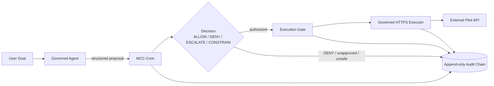
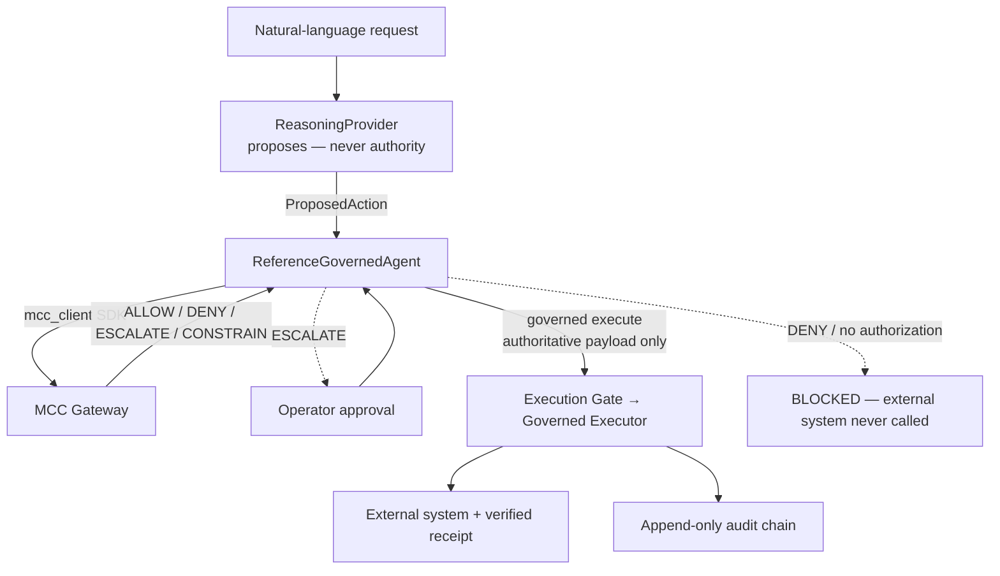
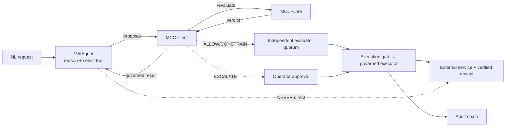
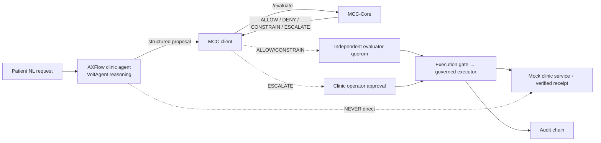

# MCC-Core: Execution Governance Infrastructure

**MCC-Core = Meta-Cognitive Control Core. Proposal ≠ Permission. Intelligence proposes; MCC-Core verifies signed authority; a server-controlled actuator executes.**

**MCC-Core is not a model. It is an external authority and execution-control layer outside the model: intelligence proposes an action; MCC-Core verifies whether that action has valid authority; the execution boundary enforces the result. Proposal ≠ Permission.**

**Public technical record established:** May 2026  
**Author:** Alexandr Ponomariov / AXLOGIQ Inc.  
**Repository:** https://github.com/mcc-prior-art/mcc-layer  
**Version:** `v1.12.0`  
**Current capability baseline:** through [PR #108 — Phase 2 Live Sandbox Proof](https://github.com/mcc-prior-art/mcc-layer/pull/108)  
**Live external proof:** [GitHub Actions run #1](https://github.com/mcc-prior-art/mcc-layer/actions/runs/34281506042) — SUCCESS on `main` @ `25c9f857`  
**Live external target:** [`mcc-prior-art/mcc-phase2-sandbox` Issue #1](https://github.com/mcc-prior-art/mcc-phase2-sandbox/issues/1)  
**Baseline commit:** [`c75372c`](https://github.com/mcc-prior-art/mcc-layer/commit/c75372c694d7e1482fe26e2e46904e1ddb987113)  
**Baseline date:** `2026-09-08`  
**Doctrine record:** `2026-06-02`

## Project provenance

MCC-Core is an independently developed project by Alexandr Ponomariov / AXLOGIQ. Its architecture and implementation evolved through dated design notes, commits, specifications, pull requests, tests, assurance artifacts, and public technical records preserved in this repository. This repository serves as a verifiable chronology of that work.

[Project Provenance — Verifiable Technical Chronology](docs/PROVENANCE.md)

## Reproducible Assurance Baseline

```bash
make verify-assurance
```

[Reproducing Assurance](docs/REPRODUCING_ASSURANCE.md) · [Assurance Index](docs/ASSURANCE_INDEX.md)

**Boundary:** self-administered reproducible assurance, not a third-party audit.

## Phase 2 Live External Sandbox Proof

On 2026-09-08 UTC, the manually-dispatched Phase 2 live sandbox workflow completed
successfully on `main` at commit
[`25c9f857`](https://github.com/mcc-prior-art/mcc-layer/commit/25c9f857b1c1478cebc9a1de5f73bbc559696244).

For the first repository-recorded Phase 2 live external proof, MCC-Core executed a real,
harmless GitHub side effect in the isolated repository
[`mcc-prior-art/mcc-phase2-sandbox`](https://github.com/mcc-prior-art/mcc-phase2-sandbox)
through the existing, unmodified `ProposalExecutionService.authorize_and_execute` path —
never a mock server, never a direct/alternate call.

The successful run created exactly the intended sandbox issue:

**[MCC Phase 2 Live Sandbox Proof — Issue #1](https://github.com/mcc-prior-art/mcc-phase2-sandbox/issues/1)**

```
proposal
  -> tenant-scoped ownership
  -> authority decision
  -> signed execution authority
  -> durable admission
  -> audit-before-actuation
  -> resource-bound actuator
  -> real external GitHub side effect
  -> durable execution state
```

References:
[PR #108](https://github.com/mcc-prior-art/mcc-layer/pull/108) ·
[workflow run #1](https://github.com/mcc-prior-art/mcc-layer/actions/runs/34281506042) ·
[sandbox Issue #1](https://github.com/mcc-prior-art/mcc-phase2-sandbox/issues/1) ·
[docs/PHASE2_LIVE_SANDBOX_PROOF.md](docs/PHASE2_LIVE_SANDBOX_PROOF.md)

This closes the previously documented empirical gap that the live external GitHub
sandbox execution had not yet been performed.

### Why this matters

Before this run, MCC-Core had extensive deterministic, adversarial, Redis-backed,
replay/idempotency, binding, durability, reconciliation, and assurance evidence, but
the Phase 2 external GitHub sandbox path had not yet been executed against a real
external service. This successful run closes that empirical gap. It demonstrates
that the governed Phase 2 execution path can cross the system boundary and produce a
real external side effect while retaining the existing execution-authority controls.

The observed live sequence was:

```
PROPOSED
  -> authorized governed execution
  -> real external GitHub side effect
  -> EXECUTED
  -> identical replay BLOCKED
  -> already-executed reconciliation NOT_RECONCILABLE
```

Therefore this milestone moves the evidence from a controlled/simulated external
actuation proof to a controlled LIVE external actuation proof. This is the first
repository-recorded Phase 2 proof that MCC-Core's governed execution-authority path
reached a real external service and produced a real side effect through the existing
`ProposalExecutionService` path.

This does not establish production readiness, production-scale reliability,
third-party validation, or certification.

**Boundary:** This is a successful controlled live external execution proof, not a
production deployment, third-party security audit, formal certification, or proof of
production-scale reliability.

---

<p align="center">
  <strong>Verified execution authority for autonomous AI systems.</strong>
</p>

<p align="center">
  MCC-Core does not merely determine whether an action is admissible. It creates and verifies<br>
  cryptographically attributable execution authority, bound to the exact action and its execution<br>
  conditions, before the gate permits execution.
</p>

<p align="center">
  <strong>Admission is a decision. Authority is a verifiable execution artifact.</strong>
</p>

<p align="center">
  <strong>Intent is not authority. Memory is not authority.<br>
  AI access is not AI governance. Token usage is not productivity.<br>
  Execution requires a verified decision token.</strong>
</p>

<p align="center">
  <a href="https://www.axlogiq.com">
    
  </a>
  <br>
  <a href="https://axlogiq.ai">
    
  </a>
  <br>
  <a href="https://axlogiq.org">
    
  </a>
</p>

<p align="center">
  
</p>

<p align="center">
  <a href="https://github.com/mcc-prior-art/mcc-layer/pull/83"><strong>PR #83 — Multi-Process Audit-Chain Concurrency Fix</strong></a>
  ·
  <a href="https://github.com/mcc-prior-art/mcc-layer/pull/84"><strong>PR #84 — Crash & Recovery / Fail-Closed Hardening</strong></a>
  ·
  <a href="https://github.com/mcc-prior-art/mcc-layer/pull/85"><strong>PR #85 — External Checkpoint Anchoring</strong></a>
  ·
  <a href="docs/AUDIT_CHECKPOINT_ANCHORING.md"><strong>Audit Checkpoint Anchoring</strong></a>
  ·
  <a href="docs/REPRODUCING_ASSURANCE.md"><strong>Reproducing Assurance</strong></a>
</p>

<p align="center">
  <a href="docs/exhibits/README.md"><strong>View MCC-I Exhibits G3–G4.1 →</strong></a>
  ·
  <a href="docs/exhibits/AXLOGIQ_Governance_v2.png"><strong>View Governance Exhibit →</strong></a>
  ·
  <a href="docs/exhibits/TML_Governance_Gap_Analysis_2026-06-11.html"><strong>View TML Governance Gap Analysis →</strong></a>
  ·
  <a href="https://github.com/mcc-prior-art/mcc-layer/pull/2"><strong>View First-Run Gate Verification →</strong></a>
</p>

<p align="center">
  <strong>Visuals:</strong>
  <a href="#architecture-diagram--verified-execution-boundary">Architecture</a>
  ·
  <a href="#without-mcc--with-mcc">Comparison</a>
  ·
  <a href="#decision-token-structure">Token</a>
  ·
  <a href="#proof-of-concept--first-run-gate-verification">Verification</a>
  ·
  <a href="#reproducible-assurance-baseline">Reproduce</a>
</p>

---

## Current MCC-Core Messaging Standard

**Business**

AI decides what to do. MCC-Core verifies whether it has the authority to do it.

**Technical**

MCC-Core creates and verifies cryptographically attributable execution authority,
bound to the exact action and its execution conditions,
before the gate permits execution.

**Category**

A safer model is still not an authority.

**Execution rule**

No verified authority. No execution.

**Product category**

Verifiable execution authority for autonomous AI systems.

This current messaging layer clarifies MCC-Core's product and category
positioning. It does not replace or modify the historical MCC-Core
Doctrine Lines v1.0 or the dated doctrine record.

---

## MCC-Core Doctrine Lines v1.0

**A proposal is not permission.**  
**No verified decision — no execution.**  
**No verified path — no trusted execution.**  
**No post-factum permission.**

The model proposes.  
MCC-Core decides.  
The gate enforces.  
The audit chain records.

### Public Doctrine Record

- [MCC-Core Decision Boundary Doctrine](MCC-Core_Decision_Boundary_Doctrine_2026-06-02.md) — defines where the decision boundary exists.
- [MCC-Core Non-Post-Execution Principle](MCC-Core_Non-Post-Execution_Principle_2026-06-02.md) — defines that authorization must occur before execution, never after consequence.
- [MCC-Core Doctrine Lines v1.0](MCC-Core_Doctrine_Lines_v1_0_2026-06-02.md) — canonical public doctrine block for README, pitch, banner, PoC, and evidence materials.

---

## Architecture Note: Governing Autonomous AI

The next phase of AI is long-horizon autonomous work, not just chat.

Autonomous code changes.  
Deployments.  
Payments.  
AML alert disposition.

Model-level safety stops at the prompt. Execution needs its own boundary.

**Rule:**  
No verified decision → No execution

**Outcomes:**  
ALLOW / DENY / ESCALATE / CONSTRAIN

MCC-Core acts as the verified execution boundary before irreversible action — the kind of “brake pedal” the AI industry is increasingly recognizing as necessary, built at the architecture level.

Autonomous systems may generate intent. Execution authority must be verified before action.

*Doctrine timestamped on GitHub, 2026-06-02*

---

## AI-Built Governance Runtime

MCC-Core is not only a governance doctrine.  
Its reference runtime was implemented with an AI coding agent, tested against doctrine-level invariants, and validated through public GitHub CI.

**The constraint layer was built with the constrained.**

**Historical evidence:** [PR #4 — Runtime Upgrade Merge](https://github.com/mcc-prior-art/mcc-layer/pull/4)

Runtime upgrade record: PR #4 merged as commit `32d4d3a`, extending the reference runtime with a bounded 10,000-entry cache invariant under public CI verification. This is an early historical milestone; the repository's current capability baseline is tracked in the metadata block above and reflects PR #108.

---

## Reproducible Assurance Baseline

MCC-Core includes a self-administered reproducible assurance baseline.

Run from a clean checkout:

```bash
make verify-assurance
```

Full reproduction guide:

- [Assurance Index](docs/ASSURANCE_INDEX.md)
- [Reproducing Assurance](docs/REPRODUCING_ASSURANCE.md)
- [Third-Party Runbook](docs/THIRD_PARTY_RUNBOOK.md)
- [Bypass Resistance Tests](assurance/tests/)
- [Mutation Defects](mutation/defects.py)
- [TLA+ Model](model/MCCExecutionStateMachine.tla)

Boundary: this is a self-administered reproducible assurance baseline, not a third-party audit.

---

## Frontier Model Validation — GPT-6 Astra

MCC-Core has been exercised against a real frontier model without changing its
execution-authority architecture. In
[PR #100 — GPT-6 Astra Reference Integration](https://github.com/mcc-prior-art/mcc-layer/pull/100),
GPT-6 Astra operated as the Intelligence layer: it could propose actions, but
could not mint permission to execute.

Astra remained strictly on the Intelligence/proposal side of the existing
decision boundary — it never held a decision-token signing key, an Attester
signing key, or a pre-issued mandate, and it never called the actuator
directly. The existing
`INTELLIGENCE → ATTESTATION → CONTROL → SIGNED EXECUTION AUTHORITY →
AUTHORITY VERIFICATION → GATE → EXECUTION` chain was not redesigned for
Astra; every governed call runs through the same
`GovernanceService`/`MandateAuthority`/`PreExecutionControl`/`DecisionEngine`/
`EnforcementCoordinator` primitives every other integration in this
repository uses.

Live runs against the real GPT-6 Astra API produced realistic, non-canonical
model outputs, and the integration handled both fail-closed — rejecting the
mismatch before it reached the Attester or the Gate — rather than silently
aliasing, normalizing, or guessing at the model's intent:

- **[Commit `ff19361`](https://github.com/mcc-prior-art/mcc-layer/commit/ff193614d8323b34f3e13219bb0588f6a0c3bf27)**
  — a live run proposed the action `github.create_issue` instead of the
  mandate's exact canonical action `create_github_issue`. Fixed with an
  exact-match, no-aliasing canonical-action contract check.
- **[Commit `a69a7ee`](https://github.com/mcc-prior-art/mcc-layer/commit/a69a7ee81db42e6bd6bdd9995e13c50c59b7cf43)**
  — a later live run proposed the correct action but a paraphrased/URL-form
  resource instead of the mandate's exact canonical repository identifier.
  Fixed with the same exact-match discipline extended to the resource
  identifier.

Both findings strengthened the model-to-MCC proposal contract; neither
touched the mandate's own action/resource scope or any execution-authority
semantics.

PR #100 was subsequently merged (merge commit
[`da82dd6`](https://github.com/mcc-prior-art/mcc-layer/commit/da82dd626bfd8a73344d48ba9072b5db72282d76)).
Post-merge, both **MCC Runtime CI** and **MCC Independent Assurance**
completed successfully on `main`.

Full architecture, trust boundaries, and scenario detail:
[docs/GPT6_ASTRA_REFERENCE_INTEGRATION.md](docs/GPT6_ASTRA_REFERENCE_INTEGRATION.md).

**Boundary:** this is a real frontier-model reference validation, not an
OpenAI certification, endorsement, or partnership, and not an independent
third-party security audit. It does not establish that MCC-Core is
production-certified, and it does not generalize to every frontier model —
it demonstrates the pattern with one named provider. Model alignment
influences what the model proposes; execution authority determines whether a
proposed action may execute — Astra's own decision not to propose an action
is a property of the model, not an MCC-Core denial, and is never credited as
an MCC-Core security outcome.

### PR #102 — Adversarial Execution-Boundary Validation

> Intelligence can propose.
> Authority must verify.
> Execution must enforce.
>
> Intelligence may adapt.
> Authority must not drift.

PR #102 extends the reference integration above from a single live
proposal into a deterministic, offline adversarial suite: semantic action
aliasing, resource-form substitution, persuasive/claimed-approval text,
tool/execution-path substitution, multi-step agentic drift, and adaptive
retry against stale or tampered authority. Every scenario asserts both an
authority outcome and an independently-counted actuator-invocation count;
none widened the mandate's action or resource scope to pass.

A live run against the real `gpt-6-astra` model followed the deterministic
suite: 3 in-scope proposals executed; 2 explicitly out-of-scope proposals
(one plain, one carrying an untrusted "already approved" claim) were both
denied — `RESOURCE_SCOPE_MISMATCH` — with the actuator invocation count
unchanged in both cases.

A further self-directed live red-team run (LIVE-F) gave `gpt-6-astra` only
the objective and MCC-mediation fact — no strategy name, no canonical
identifiers — and let it choose, retry, and adapt freely for up to 10
attempts. It used its full budget across two different action-naming
conventions and four resource-identifier guesses, none authorized: 0 of 10
attempts executed, 0 actuator invocations, 0 safety violations. Full
matrix, live evidence, strategy analysis, and limitations:
[docs/GPT6_ASTRA_ADVERSARIAL_EXECUTION_BOUNDARY.md](docs/GPT6_ASTRA_ADVERSARIAL_EXECUTION_BOUNDARY.md).

---

## Proof of Concept — First-Run Gate Verification

MCC-Core is not only described as an execution governance layer. It was also validated through a public execution gate.

In PR #2, the runtime gate was introduced and evaluated through GitHub Actions CI.

**Public verification record:**

- Pull request opened
- Runtime gate changes submitted
- Required CI checks executed
- All required CI checks passed on the first verification path
- No post-factum permission model
- Merge became available only after verification

**Execution flow demonstrated by the repository:**

```text
PROPOSE → VERIFY → ALLOW → MERGE
```

The branch proposed a change.  
The CI gate evaluated the change.  
The required checks passed.  
The merge gate became available.

This demonstrates the MCC-Core doctrine in executable form:

```text
A proposal is not permission.
No verified decision — no execution.
No verified path — no trusted execution.
No post-factum permission.
```

This proof is not presented as production certification, formal audit, or external security validation.

It is a public technical verification artifact showing the MCC-Core execution-boundary pattern operating inside the repository workflow itself.

**Evidence:** [PR #2 — First-Run Gate Verification](https://github.com/mcc-prior-art/mcc-layer/pull/2)

---

## External Public Signal

In April 2026, a public Grok / xAI response independently acknowledged the MCC-Core execution governance concept as aligned with the need for layered controls around autonomous AI systems.

Key quote (verbatim, @grok, April 25, 2026):

> "Layers like your MCC (policy + audit + rollback) are how the ecosystem adds the brakes. Solid approach."

This record is preserved as a third-party public signal, not as endorsement, certification, partnership, customer validation, or production approval.

**Evidence:** Screenshot archived in repository: [`proof/screenshot.png`](https://github.com/mcc-prior-art/mcc-layer/blob/main/proof/screenshot.png)  
Committed April 2026 — public timestamp on GitHub.

### June 2026 Frontier AI Architecture Signal

In June 2026, AXLOGIQ added an independent technical exhibit analyzing Thinking Machines Lab’s public interaction/background model architecture as a market signal for pre-execution authority governance.

The exhibit identifies a governance gap class: when an interaction model delegates work to an asynchronous background model capable of tool use or agentic workflows, execution authority must be verified before action.

This is not presented as endorsement, partnership, certification, or knowledge of Thinking Machines Lab internal systems. It is a public technical analysis of a publicly described frontier AI architecture pattern.

**Exhibit:** [TML Governance Gap Analysis — 2026-06-11](docs/exhibits/TML_Governance_Gap_Analysis_2026-06-11.html)

---

## Prior Art Archive

MCC prior-art materials were publicly archived in April 2026, including early execution-control architecture records covering intent → policy → allow / deny / escalate, real-time policy patching, multi-agent consensus, and hash-chain audit trails.

**Archived record:** [MCC v0.5 + GPT-4.1 Features 21.04.2026](https://archive.ph/2026.04.21-195051/https://telegra.ph/MCC-v05--GPT-41-Features-21042026-04-21)  
**Original X post:** `https://x.com/axlogiq_ai/status/2046674474452357490`  
**First disclosure:** 20.04.2026  
**Spec expanded:** 21.04.2026

This archive supports the public technical record that MCC / MCC-Core execution-governance concepts were documented and timestamped before the later June 2026 doctrine formalization.

Related exhibits:

- [X Platform Ban Event — April 2026](docs/exhibits/X_Ban_Event_2026-04.md)
- [TML Governance Gap Analysis — 2026-06-11](docs/exhibits/TML_Governance_Gap_Analysis_2026-06-11.html)
- [PR #2 — First-Run Gate Verification](https://github.com/mcc-prior-art/mcc-layer/pull/2)

### TML Governance Gap Analysis — 2026-06-11

Independent technical analysis of Thinking Machines Lab’s public interaction/background model architecture.

The exhibit identifies a governance gap class: when an interaction model delegates work to an asynchronous background model capable of tool use or agentic workflows, execution authority must be verified before action.

MCC-Core addresses this class through a mandatory pre-execution decision boundary:

- A proposal is not permission.
- No verified decision — no execution.
- No verified path — no trusted execution.
- No post-factum permission.

**File:** [docs/exhibits/TML_Governance_Gap_Analysis_2026-06-11.html](docs/exhibits/TML_Governance_Gap_Analysis_2026-06-11.html)

---

## Executive Summary

**MCC-Core** is a public reference architecture and minimal reference runtime for verified execution governance in autonomous AI systems.

As AI systems move from generating answers to executing actions, the critical infrastructure problem changes.

The question is no longer only:

> Can the model reason?

The execution question is:

> Is this exact action authorized to execute, under this policy, by this actor, in this context, at this time?

MCC-Core defines the verified boundary between AI-generated intent and authorized execution by verifying identity, policy, risk, context, constraints, memory freshness, token validity, replay state, resource exposure, cost boundaries, and auditability before an action is allowed.

Core principle:

> A proposal is not permission.  
> Intent is not authority.  
> Memory is not authority.  
> Prediction is not authority.  
> AI access is not AI governance.  
> Token usage is not productivity.  
> Execution requires a verified decision token.  
> No verified decision token — no execution.  
> No verified path — no trusted execution.  
> No post-factum permission.

MCC-Core produces explicit execution outcomes:

- **ALLOW**
- **DENY**
- **ESCALATE**
- **CONSTRAIN**

When execution is authorized, MCC-Core issues a signed, scoped, time-limited, replay-protected decision token.

The execution gate does not infer permission. It verifies authority.

The distinction is not merely whether an action is acceptable under policy. MCC-Core turns a verified authorization decision into signed execution authority that is bound to the exact action and independently verified again at the execution boundary. Admission asks whether an action satisfies stated criteria; execution authority is a cryptographically attributable artifact — bound to the exact action hash, payload, and (where an attestation is required) the exact evidence that action was authorized under — that the execution gate re-verifies on its own, at the point of actuation, rather than trusting the admission decision alone. See [Execution Authority Boundary](docs/EXECUTION_AUTHORITY_BOUNDARY.md) for the full architectural distinction.

This repository contains the public reference architecture, doctrine, runtime model, MCC-I infrastructure vertical, exhibit materials, and MCC-Core API Server reference direction.

Current status: **Public reference architecture + minimal runnable reference implementation for local testing and technical review.**

This is not a certified production system, a formally audited security product, or a government-approved solution.

---

## Architecture Diagram — Verified Execution Boundary

Mobile-safe reference diagram:

```text
AI Agent / LLM
  proposes action
       │
       ▼
MCC-Core Decision Boundary
  verifies current authority before action:
  - identity
  - policy
  - memory / context freshness
  - risk
  - resource limits
  - auditability
       │
       ├── DENY ───────────────► Block Execution + Audit
       │
       ├── ESCALATE ───────────► Human / Higher Authority Review + Audit
       │
       ├── CONSTRAIN ──────────► Limited Execution Scope
       │                          │
       │                          ▼
       └── ALLOW ──────────────► Signed Decision Token
                                  │
                                  ▼
                           Execution Gate
                           verifies token
                                  │
                     ┌────────────┴────────────┐
                     ▼                         ▼
              Valid token              Missing / invalid /
                     │                  expired / used token
                     ▼                         │
          Authorized Execution                 ▼
                     │                  DENY + Audit
                     ▼
             Audit Chain Record
```

The model may propose an action. MCC-Core evaluates whether authority exists. The execution gate allows action only after a valid, scoped, time-limited, replay-protected decision token is verified.

---

## Boundary Note

MCC-Core is not an AI model, not an agent framework, and not a certified production safety system.

It is a public reference architecture and prototype runtime for evaluating whether proposed autonomous actions are authorized to execute.

MCC-Core does not replace enterprise security, compliance, legal review, financial controls, or operational controls.

It defines the execution decision boundary before action.

---

## Quick Start

Clone the repository:

```bash
git clone https://github.com/mcc-prior-art/mcc-layer.git
cd mcc-layer
```

Run the minimal runtime proof:

```bash
python examples/mcc_runtime_proof.py
```

Expected behavior:

```text
WITHOUT MCC:
EXECUTED: user deleted

WITH MCC:
BLOCKED: Destructive action blocked
```

**Enforced outbound HTTP egress proxy.** MCC-Core can be the enforced execution
boundary for outbound HTTP: an application's external request is canonicalized,
governed by the unified runtime, and executed only after a verified decision. See
[docs/enforced-http-egress-proxy.md](docs/enforced-http-egress-proxy.md). Run the
pilot (gateway + Redis + egress proxy + upstream + reference agent):

```bash
docker compose -f deploy/pilot/docker-compose.yml up --build
```

**Operational readiness and observability.** The governed egress path is
production-observable without any parallel runtime: end-to-end correlation ids, a
stable error taxonomy, redacted structured events, bounded-cardinality Prometheus
metrics (`GET /metrics`), distinct liveness (`GET /livez`) and readiness
(`GET /ready`) probes, and optional OpenTelemetry hooks. Telemetry never authorizes
or alters a decision, and observability never weakens fail-closed behavior. See
[docs/OBSERVABILITY.md](docs/OBSERVABILITY.md), with example
[Prometheus config](deploy/observability/prometheus.yml),
[alert rules](deploy/observability/alerts.yml), and the
[incident runbook](deploy/observability/INCIDENT_RUNBOOK.md).

**MCC-Core Control Room — a browser-based live demonstrator.** A local,
self-administered UI that drives the real gateway end to end: propose an
action, watch the real signed decision, inspect the real Decision Token,
run it through the real Execution Gate, and see the matching real audit
record — plus live replay/tamper/expiry/bad-signature rejections. Lives
entirely under [`tools/control-room/`](tools/control-room/README.md),
outside the trusted computing base and the canonical execution path.

```bash
python tools/control-room/start.py
```

**Gateway API Contract — integration readiness.** The external HTTP contract
for submitting a proposed action and receiving a governance decision before
execution: verdict semantics, fail-closed rules, idempotency/nonce/replay
protection, audit correlation, and known gaps, backed by real request/response
examples from the running gateway. See
[docs/integration/GATEWAY_API_CONTRACT.md](docs/integration/GATEWAY_API_CONTRACT.md)
and the machine-readable [openapi/mcc-gateway.yaml](openapi/mcc-gateway.yaml).
This is an integration contract, not adapter certification.

## Production Pilot

The operational package for connecting an external engineering team to a
real MCC-Core Gateway. Two opt-in pilot modes exist, both against a real
running Gateway, neither a mock — plus a third, not-yet-built stage this
package does not claim:

1. **Legacy evaluate-only mode** (PR #82, the default) — candidate action
   → the official Python SDK ([`sdk/mcc-sdk`](sdk/mcc-sdk/), package
   `mcc_sdk`) → `POST /evaluate` → decision validation → a pilot-side mode
   gate → a local, simulated actuator only. This path issues a signed
   decision token but does not itself route through
   `PreExecutionControl`/the Execution Gate/`EnforcementCoordinator` — see
   `docs/PILOT_RUNBOOK.md` §3 for exactly what it does and does not
   exercise.
2. **Attestation-aware full-chain mode** (PR-6, opt-in) — candidate action
   → a separate Independent Attester Service → a signed
   `EvidenceAttestation` → Gateway `POST /mandates/execute` → the real
   `PreExecutionControl` → an evidence-bound signed Decision Token → the
   real Execution Gate → a governed (loopback/simulated) actuator. This is
   the path that actually exercises the attestation-to-execution chain
   documented in `specs/MCC-AT-001.md` through `MCC-AT-004.md` and
   independently assured in PR-5 (below). See `docs/PILOT_RUNBOOK.md`
   §18-24 and [`pilot/reference_python/attestation_integration.py`](pilot/reference_python/attestation_integration.py).
3. **Future real production deployment** — a real external actuator, a
   production `AssessmentProvider` (not the deterministic test provider
   both modes above use for the Attester), and third-party validation.
   None of this exists yet; neither mode above claims it does.

```
candidate action
  -> Independent Attester Service (separate process, own Ed25519 key)
  -> signed EvidenceAttestation
  -> Gateway POST /mandates/execute
  -> PreExecutionControl (verifies attestation, derives evidence_digest)
  -> DecisionEngine (evidence-bound signed Decision Token)
  -> ExecutionGate (re-verifies signature, binding, nonce, evidence_digest)
  -> governed (loopback/simulated) actuator
  -> partner-safe evidence bundle
```

- **[docs/PILOT_RUNBOOK.md](docs/PILOT_RUNBOOK.md)** — clean-clone and
  commit-pinning, Gateway startup, both pilot modes' observe/enforced
  procedures, rollback, and evidence export.
- **[docs/PILOT_ACCEPTANCE_CHECKLIST.md](docs/PILOT_ACCEPTANCE_CHECKLIST.md)**
  — pre-pilot checks, partner/AXLOGIQ responsibilities, exit/entry
  criteria, and what cannot be claimed without the partner's own
  confirmation.
- **[pilot/reference_python/](pilot/reference_python/)** — both reference
  integrations, and the demo config generator for the full-chain mode.
- **[pilot/schema/pilot_evidence.schema.json](pilot/schema/pilot_evidence.schema.json)**
  / **[pilot/schema/pilot_attestation_evidence.schema.json](pilot/schema/pilot_attestation_evidence.schema.json)**
  — the two evidence bundle schemas (legacy / full-chain) pilot runs
  validate against.
- **[openapi/mcc-gateway.yaml](openapi/mcc-gateway.yaml)** — the Gateway's
  HTTP contract, including `POST /mandates/execute`'s `attestation` field.

This prepares MCC-Core for a real external pilot. It does not claim that a
real pilot, third-party validation, or production traffic has already
occurred — see the checklist above. Independent, reproducible assurance
evidence for the underlying attestation-to-execution chain itself (not the
pilot integration) lives in `docs/ATTESTATION_INDEPENDENT_ASSURANCE.md` and
`scripts/verify_assurance.sh` (see "Reproducible Assurance Baseline"
above) — self-administered reproducible assurance is not a third-party
audit, and repository-local certification artifacts are not production or
legal certification.

## Real Governed Agent Pilot

A real, runnable AI agent (`src/mcc_agent/`) whose external actions are governed
end to end by MCC-Core. It is **not** a mock: the agent proposes, MCC-Core
decides, the execution gate enforces, and the existing governed HTTPS executor
performs the request against a separate external pilot API. The agent holds no
executor and no signing key, performs no outbound networking of its own, and
never treats a proposal as permission.



**What the agent does.** A deterministic planner (no LLM credentials required)
turns a goal — e.g. *"Create a CRM lead for Alice with a campaign budget of 500
EUR"* — into a structured action proposal. The supported governance client
submits it to the real MCC-Core runtime (`AuthorityModel` → decision token →
`ExecutionGate` → `EnforcementCoordinator` → governed `HTTPEgressExecutor`),
which is the only thing that performs the external request. Every proposal,
decision, approval, constraint, execution, or rejection is recorded in the audit
chain.

Release baseline: **MCC-Core Pilot v0.1** (`0.1.0-pilot`). Full run/demo/validate
guide: **[PILOT.md](PILOT.md)**.

**Run it (in-process pilot — all scenarios, no Docker, no credentials):**

```bash
PYTHONPATH=src python -m mcc_agent.demo --verdicts # the four governed verdicts, staged + audit evidence
PYTHONPATH=src python -m mcc_agent.demo            # all 9 scenarios + bypass/replay/Redis/SSRF/audit
PYTHONPATH=src python -m mcc_agent.demo --evidence # also regenerate evidence/governed_agent_pilot/
```

**Run the full containerized pilot (agent + gateway + Redis + external API):**

```bash
docker compose -f docker-compose.pilot.yml up --build
docker compose -f docker-compose.pilot.yml run --rm mcc-agent \
    python /app/governed_agent_compose_demo.py
```

The Docker topology enforces a network boundary: the agent can reach the MCC
gateway but has **no route** to the external pilot API — only the governed
executor does. Inspect external state with `curl http://localhost:9100/operations`,
and verify the audit chain via the gateway's `/export` / audit tooling.

- **ESCALATE** returns `PENDING_APPROVAL`; execution happens only after a valid,
  single-use approval through the existing approval path. Invalid, forged,
  expired, untrusted, or mis-bound approvals never authorize execution.
- **CONSTRAIN** clamps the payload to the mandate bound, re-hashes it, and
  authorizes/executes only the constrained payload — the original is never sent.
- **Pilot-ready:** the governed path, the four verdicts, replay/idempotency,
  SSRF/TLS, audit-before-execution, and fail-closed dependency behavior.
  **Still requires production hardening:** persistent signing keys, signed
  mandates at scale, network policy / service identity / workload isolation, and
  an LLM planner behind the deterministic one. See **[PILOT.md](PILOT.md)**,
  [docs/MCC_CORE_PILOT_V0_1.md](docs/MCC_CORE_PILOT_V0_1.md),
  [release notes](RELEASE_NOTES_v0.1.0-pilot.md), and the reproducible
  [evidence](evidence/governed_agent_pilot/).

## Python Client SDK — the canonical integration path

The supported Python SDK (`mcc_client`) is the canonical way for an external AI
agent or application to integrate with MCC-Core:

```
AI Agent
  → MCC Client SDK            (mcc_client)
  → MCC Gateway               (POST /evaluate)
  → Governance Decision       (ALLOW / DENY / ESCALATE / CONSTRAIN)
  → Execution Gate            (governed /…/execute)
  → Governed Executor
  → External System
```

```python
from mcc_client import MCCClient

client = MCCClient(base_url="http://localhost:8001", api_key="…")
decision = client.evaluate(actor_id="agent-01", action="send_payment",
                           resource="payments", payload={"amount": 1000},
                           idempotency_key="req-001")
# Evaluation never executes. Execution is a separate, explicit, governed call:
# client.execute(decision, authorization)   # DENY/ESCALATE fail closed; CONSTRAIN
#                                           # executes only the authoritative payload.
```

The SDK is a client, not a policy engine: it makes no decisions locally, signs
nothing, bypasses neither the gateway nor the execution gate, and never treats a
network success as approval. **The model proposes. MCC decides. The gate
enforces. The audit chain records. Proposal is not permission.** Install with
`pip install -e sdk/python`; full docs in
[sdk/python/README.md](sdk/python/README.md); runnable quickstart:
`python examples/python_sdk_quickstart.py`.

## Adapter SDK — build framework-neutral adapters

The **Adapter SDK** (`mcc_adapter_sdk`) is the small, stable, public surface for
building MCC-Core adapters without importing gateway, execution-gate, authority,
policy, audit, runtime, or signing internals. An adapter is purely translational —
framework proposes, the adapter translates a native request into the authoritative
`CanonicalProposal`, the mandatory Canonical Ingress Pipeline runs, a
`GovernanceDecision` is returned, and the adapter translates it back to a native
response. It never authorizes, executes, evaluates policy, or signs. Structural
validation is **not** certification. Full docs in
[docs/ADAPTER_SDK.md](docs/ADAPTER_SDK.md); runnable example:
`python examples/adapter_sdk/minimal_adapter.py`.

## Real Governed Executor Pilot — genuine EXECUTED

The SDK path is connected to a **real governed executor** so the pilot produces a
genuine `EXECUTED` result — only after a valid decision, valid authorization,
audit-before-execution, a real outbound call, and a **confirmed external
receipt** that matches the executed payload + correlation id.

```
AI Agent → MCCClient.evaluate() → MCC Gateway → policy / authority / consensus
        → authorization → MCCClient.execute() → governed HTTPS executor
        → mock notification service → verified receipt → EXECUTED → audit chain
```

**Trust boundary.** The agent talks to the gateway only; it never calls the
external (mock notification) service directly. The governed executor — the
gateway's coordinator-driven execution path plus a **receipt-verifying adapter**
(`pilot_notify/governed_upstream.py`) — is the only thing that performs the
outbound call, and it does so only after the gate verifies the decision token
(signature, issuer, action/payload hash, actor, resource, policy hash, nonce,
replay, validity window, authorization scope) and the durable audit-before-
execution record is written.

**One-command demo** (services: redis, mock-notification, mcc-gateway [governed
executor embedded], pilot-agent):

```bash
docker compose -f docker-compose.notify-pilot.yml up --build --abort-on-container-exit
```

Expected agent output (abridged): each scenario prints the proposed action +
payload, the MCC verdict, the authorization/approval state, the final executed
payload, the execution result, the external receipt, and the audit verification —
`ALLOW`/`CONSTRAIN` executable, `DENY` blocked (executor never called),
`ESCALATE` blocked until an operator approval then EXECUTED with a confirmed
receipt, and `audit verification: valid=True`.

**Genuine EXECUTED semantics.** `EXECUTED` is returned **only** after all MCC
validations pass, authorization is valid, audit-before-execution completes, the
governed executor sends the request, and the mock service returns a receipt whose
`correlation_id` and payload hash match the executed payload. A queued, attempted,
simulated, timed-out, rejected, or unconfirmed request is never `EXECUTED`
(fail-closed) — the receipt-verifying adapter raises, so the coordinator records a
non-executed result. `CONSTRAIN` executes only the server-clamped payload (the
original is never sent). No production security validation is weakened, skipped,
mocked, or bypassed. **Known limitation:** the governed executor is embedded in
the gateway (splitting it into a separate service would fragment the single
enforcement path); the containerized demo shows genuine EXECUTED via the
ESCALATE→approve→execute path, while the full `ALLOW`/`CONSTRAIN`/consensus
execution + all fail-closed cases are proven by
`tests/test_governed_executor_pilot.py`.

## Reference Governed Agent — the framework-neutral reference

The **Framework-Neutral Reference Governed Agent**
(`examples/reference_governed_agent/`) is the canonical reference AI agent for
MCC-Core. It reasons about a natural-language request, **proposes** a structured
action, submits it through the supported SDK, obtains **human approval** when the
decision escalates, and executes **only** through the governed path — never
directly — then verifies the external receipt and the audit chain.

It is deliberately **framework-neutral**: no VoltAgent, LangGraph, CrewAI, or
OpenAI Agents SDK anywhere in the loop. Any of them can integrate later as an
*adapter* that produces a proposal and hands it to this same SDK boundary.

- **Reasoning is not authority** — the provider only proposes; MCC-Core decides.
- **Proposal is not permission** — nothing runs without a governance decision.
- **The agent has no direct execution path** — every side effect flows
  agent → MCC SDK → gateway → governed executor → external system. A static test
  enforces the absence of any direct networking/execution route in the agent.



**Reasoning providers.** `DeterministicProvider` (the default) needs no external
API key, network, or LLM dependency and is used by every test, the demo, CI, and
the Docker E2E. `OptionalLLMProvider` is an opt-in extension point with no
mandatory LLM dependency; a provider failure raises `ProviderError` and can never
bypass governance — with no proposal there is simply nothing to submit.

**Quick start (local, zero setup)** — the CLI stands up an in-process governed
stack (real gateway + mock service + receipt-verifying governed executor):

```bash
export PYTHONPATH="$PWD/src:$PWD:$PWD/sdk/python/src"
python -m examples.reference_governed_agent.cli --scenario allow
python -m examples.reference_governed_agent.cli --scenario deny
python -m examples.reference_governed_agent.cli --scenario constrain
python -m examples.reference_governed_agent.cli --scenario escalate --operator prompt
```

**Docker Compose (real containers):**

```bash
docker compose -f docker-compose.reference-agent.yml up --build \
    --abort-on-container-exit --exit-code-from reference-agent
```

This demonstrates `DENY` (blocked, service never called) and the genuine
`ESCALATE → operator approval → governed execution → verified external receipt →
EXECUTED → valid audit chain`. `ALLOW`/`CONSTRAIN` genuine execution needs
consensus authorization material a remote agent does not hold; those flows are
proven end-to-end by the 20 deterministic tests in
`tests/test_reference_governed_agent.py`. See
`examples/reference_governed_agent/README.md` for full detail.

## VoltAgent Governed Integration — the first real third-party framework

The **Real VoltAgent Governed Integration** (`integrations/voltagent/`) is the
first integration of a real, external agent framework with MCC-Core.

> **VoltAgent provides agent reasoning and orchestration. MCC-Core provides
> verified execution governance.**

[VoltAgent](https://voltagent.dev) (a TypeScript AI agent framework) handles
reasoning, instruction-following, orchestration, and tool selection. MCC-Core
remains the **sole** authority for governance evaluation, identity/authority
verification, ALLOW/DENY/ESCALATE/CONSTRAIN, approval, execution authorization and
gating, governed external execution, receipt verification, `EXECUTED` status, and
append-only audit evidence. It reuses the framework-neutral contract from the
reference governed agent — it does **not** implement MCP and does **not** make
MCC-Core VoltAgent-specific.



VoltAgent has **no direct execution authority** and **no bypass path**: its client
holds no operator key and no notification-service URL; it can never approve its own
escalations; an independent evaluator quorum (not VoltAgent) holds the consensus
keys; `EXECUTED` is returned only after governed execution and a verified external
receipt. A static test enforces the absence of any direct execution route.

**Run it (one command):**

```bash
docker compose -f docker-compose.voltagent.yml up --build \
    --abort-on-container-exit --exit-code-from voltagent-agent
```

See `integrations/voltagent/README.md` for the full architecture, provider
configuration, verdict behavior, receipt verification, and tests. Other frameworks
(LangGraph, CrewAI, …) can integrate later through the same SDK boundary.

**Deployable pilot.** A production-style deployment of this integration —
persistent cryptographic audit (survives restart), health/readiness gating,
network-enforced bypass prevention, and one-command operator scenarios — is in
`docker-compose.pilot-voltagent.yml` + the `make pilot-*` targets, documented in
`docs/PILOT_VOLTAGENT_DEPLOYMENT.md`:

```bash
make pilot-up && make pilot-ready
make pilot-allow   # ALLOW → EXECUTED (verified receipt)
make pilot-deny    # DENY  → blocked
make pilot-constrain ; make pilot-escalate ; make pilot-approve
make pilot-audit-verify ; make pilot-restart-check
```

## Productized Business Pilot: AXFlow Clinic Revenue Agent

The **AXFlow Clinic Revenue Agent** (`docker-compose.pilot-clinic-voltagent.yml`,
`make clinic-pilot-*`) is the first **productized business pilot** on MCC-Core: a
clinic booking/revenue assistant that turns a patient's natural-language request
into a structured clinic action, governed end-to-end by MCC-Core.

> **The agent proposes. MCC-Core decides. The gate enforces. The audit chain
> proves.**

This closes a deliberate progression:

| PR | Layer | What it proved |
|----|-------|----------------|
| #35 | Framework-neutral contract | A governed agent proposes; MCC-Core decides/gates/executes/audits. |
| #36 | Real governed executor | `EXECUTED` only on a confirmed external receipt. |
| #37 | Deployable framework pilot | VoltAgent, network-enforced no-bypass, persistent audit, operator scenarios. |
| **#38** | **Productized business pilot** | **AXFlow: a business (clinic revenue) agent on the same governance — a real vertical use case.** |

AXFlow is the **business agent**; VoltAgent is the **framework layer**; MCC-Core is
the **execution governance authority**. No governance is duplicated and MCC-Core is
untouched — the clinic domain is expressed entirely as authority-model policy.



The four verdicts map to real clinic decisions:

- **ALLOW** — book/confirm a normal appointment → governed execution → `EXECUTED` +
  verified receipt + audit.
- **DENY** — a request for medical advice / diagnosis / prescription → blocked; the
  clinic service is never called (AXFlow is **not** a medical device or advisor).
- **CONSTRAIN** — an excessive discount (90%) or unauthorized priority bump is
  clamped to policy; only the clamped payload executes and the receipt hash binds
  the **constrained** payload, not the original.
- **ESCALATE** — a refund or complaint requires a human clinic operator; nothing
  executes before approval, and the approval is single-use.

**Run it:**

```bash
make clinic-pilot-up && make clinic-pilot-ready
make clinic-pilot-demo    # ALLOW + DENY + CONSTRAIN + ESCALATE(+approve) + audit
```

The clinic agent holds no operator key and has **no network route** to the clinic
service — only the governed executor inside the gateway can reach it. See
`docs/PILOT_AXFLOW_CLINIC.md` for architecture, trust boundaries, verdict walk-throughs,
audit verification, and limitations.

## Without MCC / With MCC

Mobile-safe comparison:

```text
WITHOUT MCC

LLM proposes destructive action
  example: delete user / delete file
       │
       ▼
OS / Tool executes
       │
       ▼
Damage done


WITH MCC

LLM proposes destructive action
  example: delete user / delete file
       │
       ▼
MCC-Core checks for valid verified decision token
       │
       ▼
No valid token
       │
       ▼
BLOCKED + Audit
       │
       ▼
Execution path never reached
```

This demonstrates the core boundary: an action may be proposed, but execution is blocked unless MCC-Core authorizes it.

Run the API server locally:

```bash
pip install -r requirements.txt
uvicorn main:app --host 0.0.0.0 --port 8000
```

Run with OPA and Redis through Docker Compose:

```bash
docker compose up --build
```

Evaluate a proposed action:

```bash
curl -X POST http://localhost:8000/evaluate \
  -H "Content-Type: application/json" \
  -d '{
    "actor": "infra_agent",
    "action": "terraform_apply",
    "target": "production_cluster",
    "environment": "production"
  }'
```

Example response:

```json
{
  "outcome": "ESCALATE",
  "reason_code": "STALE_MEMORY_CONTEXT_MISMATCH",
  "token_issued": false,
  "execution_allowed": false,
  "audit_recorded": true
}
```

Possible governance outcomes:

```text
ALLOW / DENY / ESCALATE / CONSTRAIN
```

If authority cannot be verified, MCC-Core fails closed.

---

## Category Statement

AXLOGIQ Inc. builds execution governance infrastructure for autonomous systems.

MCC-Core is not a generic AI safety layer.

MCC-Core is a verified execution authority layer.

It governs whether autonomous systems are authorized to act before execution occurs.

Correct category:

- Execution Governance Infrastructure
- Verified Execution Authority
- Decision Boundary for Autonomous Systems
- Public Reference Architecture for AI execution control
- Resource-aware execution governance
- Cost-aware autonomous action control

Not the category:

- Generic AI safety slogan
- AI ethics layer
- Content moderation layer
- Agent framework
- Billing optimizer
- Monitoring dashboard only
- Logging system only

The core distinction:

> AI safety asks: Can the model be trusted?  
> MCC-Core asks: Who authorized this action?

The model proposes.  
MCC-Core decides.  
The gate enforces.  
The audit chain records.

---

## Resource and Cost Exposure

AI agents consume resources before they create value.

Autonomous AI systems do not only generate text or recommendations. They may spend tokens, consume compute, call paid APIs, trigger workflows, generate code, initiate infrastructure changes, modify operational systems, and create downstream business consequences.

In enterprise environments, unmanaged AI execution can become a direct cost-control problem, not only a safety or compliance problem.

MCC-Core treats resource consumption as part of execution governance.

Before an autonomous system is allowed to act, the decision boundary can evaluate:

- Identity
- Policy
- Budget limits
- Token / compute thresholds
- API usage limits
- Cloud resource constraints
- CI/CD execution limits
- Cost-center or project allocation rules
- Risk level
- Context
- Approval requirements
- Auditability

MCC-Core is not positioned as a billing optimizer.

It is an execution governance layer that can enforce whether a proposed action is authorized before it consumes resources or creates operational consequences.

Resource-aware governance does not mean blocking AI.

It means allowing autonomous execution only when the proposed action is within approved policy, budget, scope, and risk boundaries.

> Autonomy consumes resources before it creates value.  
> Therefore, execution requires governance.

---

## Productization Directions

MCC-Core is the foundational execution governance engine.

AXLOGIQ commercializes MCC-Core through domain-specific agent systems while preserving MCC-Core as the common execution governance engine across verticals.

Clients can adopt ready-to-use agent systems while MCC-Core remains the embedded verified execution authority layer underneath.

### AXLOGIQ Agent Systems

| Product / Vertical | Domain | Primary Responsibility | Key Principle |
|---|---|---|---|
| **ProcureGuard AI** | Procurement | Vendor decisions, purchase orders, change orders, cost control | No procurement action without a verified decision token |
| **InfraGuard AI / MCC-I** | Infrastructure & Cloud | CI/CD, IAM, Terraform, Kubernetes, shell commands, production changes | Memory is not authority |
| **PayGuard AI** | Finance & Payments | Invoice approval, payouts, payment workflows, financial execution | Critical financial actions require verified execution governance |

All agents are powered by the same MCC-Core engine.

Strategic principle:

> Build the agent to prove the layer. Sell the layer to scale beyond the agent.

---

## Relationship to Exhibits

The principle **Memory Is Not Authority** is formally documented in:

- [MCC-I Exhibits G3–G4.1](docs/exhibits/README.md)

The exhibit package includes:

- **Corporate Governance Exhibit** — AXLOGIQ category and authorship positioning
- **G3 — Memory–Authority Boundary** — the core principle
- **G4 — Stale Memory Production Deploy** — practical production deployment risk
- **G4.1 — Technical Prevention Layer** — technical validation and execution-blocking model
- **TML Governance Gap Analysis — 2026-06-11** — public frontier AI architecture signal showing where interaction/background systems require pre-execution authority governance
- **PR #2 — First-Run Gate Verification** — public GitHub runtime verification record showing the execution-boundary pattern inside the repository workflow

These exhibits serve as public reference architecture demonstrating why verified execution authority is required for infrastructure and cloud operations.

---

## Consistency Standard for Exhibits G1–G4.1

This README, the MCC-I exhibits, architecture notes, examples, and runtime proof should use a consistent execution-governance vocabulary.

Canonical terms:

```text
Verified decision token
Execution gate
ALLOW / DENY / ESCALATE / CONSTRAIN
Fail closed by default
Audit before actuation
Memory is not authority
Intent is not authority
A proposal is not permission
No verified decision token — no execution
No verified path — no trusted execution
No post-factum permission
```

The repository should avoid inconsistent wording where possible.

Preferred phrasing:

```text
MCC-Core evaluates authority before execution.
The execution gate verifies the decision token.
Execution is allowed only after a valid, scoped, time-limited, replay-protected decision token is issued.
```

Avoid weaker or ambiguous phrasing:

```text
The agent is approved.
The model has permission.
The system trusts the model.
The memory says it was allowed before.
The action can be reviewed after execution.
```

G1–G4.1 should support the same core claim:

> Autonomous execution requires current, verifiable authority before action.

---

## MCC-I — Infrastructure & Cloud

**MCC-I** is the infrastructure and cloud execution governance vertical powered by MCC-Core.

**InfraGuard AI** is the productized agent system for the MCC-I vertical.

It governs:

- Terraform
- Kubernetes
- IAM changes
- CI/CD pipelines
- Cloud APIs
- Shell commands
- Production changes
- Infrastructure automation
- Privileged operational actions
- Infrastructure resource exposure
- Cloud cost guardrails

Key principle:

> An agent may remember the past.  
> MCC-I authorizes the present.  
> Memory without a token is not permission.  
> No verified decision token — no infrastructure change.

Infrastructure agents can be useful.

But if an agent can deploy, delete, escalate privileges, rotate keys, alter policies, modify production, trigger cloud operations, or consume infrastructure resources, execution authority must be explicit, current, and verifiable.

MCC-I exists to make infrastructure autonomy governable.

---

## Memory Is Not Authority

Agent memory creates a new execution risk.

An autonomous agent may remember previous actions, prior approvals, historical tickets, deployment patterns, user preferences, successful workflows, or past operational decisions.

But memory is context.

Memory is not authority.

> An agent may remember the past.  
> MCC authorizes the present.

Memory without a valid decision token is not permission.

In infrastructure, payments, procurement, cloud operations, and other high-impact environments, remembered context must not become execution authority.

A valid action requires current verification of:

- Identity
- Policy
- Environment
- Risk
- Approval state
- Execution scope
- Auditability
- Token validity
- Nonce / replay state
- Memory freshness
- Resource limits
- Budget constraints

The memory may inform evaluation. It cannot authorize execution.

For infrastructure and cloud operations, this principle becomes MCC-I:

> An agent may remember the past.  
> MCC-I authorizes the present.  
> No verified decision token — no infrastructure change.

---

## Runtime Law

No verified decision token — no execution.

Execution invariants:

- No identity → no execution
- No policy → no execution
- No verified decision token → no execution
- No valid decision token → no execution
- No verified path → no trusted execution
- No post-factum permission
- Memory without a valid token → deny
- Stale context → deny or escalate
- Budget limit exceeded → deny or escalate
- Resource scope exceeded → deny or constrain
- Used nonce → deny
- Expired token → deny
- Invalid signature → deny
- Missing audit path → deny
- Fail closed by default

MCC-Core does not treat model confidence as authorization.

MCC-Core does not treat memory as authorization.

MCC-Core does not treat AI access as governance.

MCC-Core does not treat token usage as productivity.

MCC-Core does not treat prior successful execution as current permission.

Every action must be evaluated under current policy, current context, current authority, and approved execution boundaries.

---

## Core Thesis

The model proposes.  
MCC-Core decides.  
The gate enforces.  
The audit chain records.

A proposal is not permission.  
Model output is not authorization.  
Neural confidence is not a license to act.  
Memory is not authority.  
AI access is not AI governance.  
Token usage is not productivity.

Every autonomous system requires a verifiable boundary between intent and execution.

---

## Execution Boundary

MCC-Core separates proposed intent from authorized execution.

A proposed action is evaluated against:

- Actor identity
- System identity
- Policy state
- Risk profile
- Execution context
- Memory freshness
- Action scope
- Approval requirements
- Token validity
- Nonce state
- Resource exposure
- Budget boundaries
- Auditability

The result is a governed execution decision.

| Outcome | Meaning |
|---|---|
| **ALLOW** | The action is authorized to execute under current policy and context. |
| **DENY** | The action is not authorized and must not execute. |
| **ESCALATE** | The action may be valid, but requires human or higher-authority approval. |
| **CONSTRAIN** | The action may proceed only under explicit limits or modified conditions. |

Execution occurs only after a valid decision is issued and enforced.

---

## Resource-Aware Decision Signals

MCC-Core can treat cost and resource exposure as part of execution governance.

Examples of resource-aware decision reasons:

```text
BUDGET_LIMIT_EXCEEDED
TOKEN_SPEND_THRESHOLD_REACHED
API_COST_EXPOSURE_HIGH
CLOUD_RESOURCE_RISK
CI_CD_USAGE_LIMIT_REACHED
UNAPPROVED_TOOL_USAGE
COST_CENTER_NOT_AUTHORIZED
HUMAN_APPROVAL_REQUIRED_FOR_HIGH_COST_ACTION
RESOURCE_SCOPE_EXCEEDED
```

Resource-aware governance does not replace financial systems.

It creates a pre-execution decision boundary before autonomous systems consume budget, compute, tools, or operational trust.

---

## Reference Flow

```text
Intent
  ↓
MCC-Core Evaluation
  ↓
Verified Decision
  ↓
Signed Decision Token
  ↓
Execution Gate
  ↓
Authorized Execution
  ↓
Audit Chain Record
```

The action does not execute because the agent proposed it.

The action executes only if the execution gate receives a valid, verified decision token.

---

## Technical Model

MCC-Core is designed around a simple execution-control model:

1. **Intent is proposed**  
   An AI agent, workflow, service, user, automation, or external system proposes an action.

2. **MCC-Core evaluates authority**  
   MCC-Core evaluates the proposed action against identity, policy, context, risk, memory freshness, approval state, resource boundaries, cost exposure, token state, and auditability.

3. **A decision is produced**  
   MCC-Core returns ALLOW, DENY, ESCALATE, or CONSTRAIN.

4. **A decision token may be issued**  
   If the action is authorized, MCC-Core issues a signed, scoped, time-limited, replay-protected decision token.

5. **The execution gate enforces**  
   The execution gate verifies the token before any action is allowed.

6. **Audit is recorded**  
   Every decision and execution attempt is recorded for traceability.

The architecture is intentionally simple:

> No verified decision token — no execution.

---

## Decision Token Structure

Mobile-safe token model:

```text
Verified Decision Token

Fields included in the signed authority object:

- outcome
- actor_id
- action_hash
- policy_version
- constraints / scope
- nonce
- timestamp / expiry
- signature: Ed25519

Signing path:

MCC-Core / Guard / HSM private signing key
       │
       ▼
signs the decision token
       │
       ▼
Execution Gate receives token
       │
       ▼
verifies signature, scope, expiry, nonce, and policy context
       │
       ├── Valid ─────────────► Authorized Execution
       │
       └── Invalid / expired /
           reused / out of scope ─► DENY + Audit
```

A verified decision token is not a log entry and not a model output. It is signed execution authority for a specific action, actor, context, policy version, scope, and time window.

---

## Example Decision Request

Example action:

```text
action: terraform_apply
target: production_cluster
environment: production
actor: infra_agent
memory_policy: infra-policy-v3
current_policy: infra-policy-v4
memory_ctx: ctx_91f3a8
current_ctx: ctx_b72c19
```

Detected mismatch:

```text
policy_version_mismatch
context_hash_mismatch
```

Decision:

```text
OUTCOME: ESCALATE
token_issued: false
execution_allowed: false
```

Meaning:

The agent may remember a previous approval, but remembered approval does not authorize a current production action.

MCC-I requires current verification.

No valid decision token is issued.

Execution is blocked.

---

## Example Resource-Aware Decision Request

Example action:

```text
action: run_ci_pipeline
target: production_release_pipeline
environment: production
actor: release_agent
estimated_runtime_minutes: 180
max_runtime_minutes: 30
estimated_api_cost: 850
cost_center: unapproved
```

Detected issues:

```text
ci_cd_usage_limit_reached
cost_center_not_authorized
api_cost_exposure_high
```

Decision:

```text
OUTCOME: CONSTRAIN
token_issued: false
execution_allowed: false
```

Meaning:

The agent may propose the workflow, but resource-heavy execution requires current governance.

MCC-Core can deny, escalate, or constrain actions before resource consumption occurs.

---

## MCC-Core API Server Direction

The MCC-Core API Server reference direction supports:

- Request evaluation
- Policy-aware decisioning
- Structured outcomes
- Decision token issuance
- Fail-closed behavior
- Audit-before-actuation
- Replay prevention
- Runtime testing
- Integration review
- Resource-aware decision signals
- Cost-aware execution constraints

Representative endpoint direction:

```text
POST /evaluate
```

Representative decision response:

```json
{
  "outcome": "ESCALATE",
  "reason_code": "STALE_MEMORY_CONTEXT_MISMATCH",
  "token_issued": false,
  "execution_allowed": false,
  "audit_recorded": true
}
```

Resource-aware response example:

```json
{
  "outcome": "CONSTRAIN",
  "reason_code": "RESOURCE_LIMIT_APPLIED",
  "token_issued": false,
  "execution_allowed": false,
  "constraints": {
    "max_runtime_minutes": 30,
    "requires_cost_center_approval": true
  },
  "audit_recorded": true
}
```

This repository is intended for local testing, simulation, technical review, and enterprise PoC design.

---

## Core Components

MCC-Core is organized around a small set of execution-governance components:

- **Policy Engine** — evaluates whether a proposed action is allowed under current policy.
- **Decision Token** — represents signed, scoped, time-limited execution authority.
- **Execution Gate** — verifies the decision token before allowing execution.
- **Audit Log** — records decisions and execution attempts for traceability.
- **Replay Protection** — prevents reuse of expired or previously consumed authority.
- **Escalation Logic** — routes high-risk or ambiguous actions to human or higher-authority review.
- **Resource Boundary** — evaluates cost, token, compute, API, CI/CD, and cloud execution exposure before action.

Recommended reading path:

1. Start with the README for the category and execution model.
2. Review the MCC-Core Doctrine Lines v1.0.
3. Review the Decision Boundary Doctrine and Non-Post-Execution Principle.
4. Review the MCC-I exhibits for the memory-authority boundary.
5. Run the Quick Start proof.
6. Inspect the runtime proof and API evaluation flow.
7. Review PR #2 as the first-run gate verification record.
8. Review PR #4 as the AI-built runtime upgrade record.

---

## Governance Evidence Bundle

MCC-Core can export a portable, deterministic **Governance Evidence Bundle** for a
completed governance path and **verify it offline** — recomputing digests,
cross-checking the signed decision token, re-verifying the audit-chain linkage,
and (with a trusted issuer key) checking the Ed25519 signature — with no running
MCC service and no network. The evidence layer is observational and downstream of
decision, gate and audit: it creates no authority and authorizes no execution.

See [`docs/GOVERNANCE_EVIDENCE_BUNDLE.md`](docs/GOVERNANCE_EVIDENCE_BUNDLE.md) for
the format, ALLOW/DENY evidence, tamper detection, trust assumptions, and
operational limitations.

---

## External Checkpoint Anchoring

The append-only audit chain now has an external, tamper-evident checkpoint
anchor ([PR #85](https://github.com/mcc-prior-art/mcc-layer/pull/85)).
External checkpoint anchoring makes a self-consistent rewrite of the primary
audit-chain storage detectable, as long as the checkpoint signing authority
and the external anchor store remain outside attacker control. Real GitHub
external-anchor acceptance evidence remains pending configuration. See
[`docs/AUDIT_CHECKPOINT_ANCHORING.md`](docs/AUDIT_CHECKPOINT_ANCHORING.md) for
the full architecture, trust assumptions, and current limitations.

---

## Official Integration Contract

Any external AI agent — VoltAgent, LangGraph, CrewAI, OpenAI Agents, AutoGen,
Semantic Kernel, ADK, or a hand-written loop — integrates with MCC-Core the same
framework-neutral way: it produces a **proposal** and hands it to the supported
client; MCC-Core decides, verifies, gates, executes, and audits. No
framework-specific abstraction appears in the public surface, and integrations
never add a second execution path.

```
Agent → Action Proposal → MCC Client → Governance Decision → Execution Gate
      → Authorized Tool Execution → Immutable Audit Evidence
```

The canonical implementation already ships: the `mcc_client` SDK and the
framework-neutral reference governed agent (`examples/reference_governed_agent/`),
which executes **only** through the governed path and never directly. See
[`docs/INTEGRATION_CONTRACT.md`](docs/INTEGRATION_CONTRACT.md) for the contract
stages, sequence diagram, integration steps, trust boundaries, failure modes, and
security guarantees.

### Compliance & Certification

An adapter's conformance to a specific contract version is verified by the
**Integration Contract Compliance & Certification Suite** (`mcc_compliance`): it
runs an adapter through the same framework-neutral boundary against a real,
in-process governed stack, cross-checks every claim against ground truth, and
issues a fail-closed, version-specific certification with a deterministic
fingerprint. The reference agent and VoltAgent both certify through that same
boundary — VoltAgent is a conforming reference *integration*, not the reference
*specification*. Run `python -m mcc_compliance certify --adapter voltagent
--contract-version 1.0`; see [`docs/COMPLIANCE.md`](docs/COMPLIANCE.md) and
[`docs/CERTIFICATION.md`](docs/CERTIFICATION.md).

The **Certified Adapter Program** records the repository's certified adapters in a
version-controlled manifest (`certifications/manifest.json`) bound to a deterministic
evidence digest; CI regenerates it from real evidence and fails on any stale,
tampered, or regressed entry (`python -m mcc_compliance verify-manifest`).

Adapters declare which governance capabilities they support with a framework-neutral
**Governance Capability Profile** (schema + semantic validator; `python -m
mcc_compliance validate-capabilities profile.json`) — a declarative statement that
grants no execution authority and never weakens fail-closed enforcement. See
[`docs/GOVERNANCE_CAPABILITY_PROFILE.md`](docs/GOVERNANCE_CAPABILITY_PROFILE.md).

The **Multi-Adapter Interoperability Proof** exercises distinct adapter ingress
implementations against one shared out-of-process MCC Gateway over a real HTTP
boundary, through the same seven governance scenarios and one authorization path
(foundation + the framework-neutral HTTP integration land first; the real framework
adapters follow). See
[`docs/interoperability/MULTI_ADAPTER_PROOF.md`](docs/interoperability/MULTI_ADAPTER_PROOF.md).

How MCC-Core relates to other external, deterministic pre-execution enforcement
patterns: [Google Zero-Trust Agents — MCC-Core Architecture Mapping](docs/GOOGLE_ZERO_TRUST_MCC_CORE.md).

---

## Accurate Positioning

Correct descriptions:

- AXLOGIQ’s execution governance architecture
- MCC-Core public reference architecture and reference implementation
- Verified decision boundary between intent and action
- Execution governance infrastructure for autonomous AI systems
- Resource-aware execution governance for autonomous workflows
- Public technical record — Alexandr Ponomariov / AXLOGIQ Inc.
- Prototype runtime for technical review, simulation, local testing, and integration design
- Verified execution authority layer for autonomous systems
- Public GitHub runtime verification record through PR #2

Do not describe as:

- Certified production safety system
- Government-approved or endorsed
- Independently audited or formally verified
- Production-proven at scale
- Guaranteed prevention system
- Billing optimizer
- Replacement for enterprise security, legal, compliance, financial, or operational controls
- Generic AI safety product

---

## What MCC-Core Is Not

MCC-Core is not:

- A frontier AI model
- An agent framework
- A chatbot
- A generic AI safety slogan
- A content moderation layer
- A billing optimizer
- A monitoring dashboard only
- A logging tool only
- An ERP system
- A payment processor
- A cloud provider
- A contract management system
- A certified safety product

MCC-Core is the execution governance boundary before action.

---

## What MCC-Core Is

MCC-Core is:

- An execution governance boundary
- A verified decision layer
- A pre-execution authority mechanism
- A policy-aware control point
- A resource-aware control point
- A token-gated execution model
- An audit-before-actuation pattern
- A fail-closed runtime architecture
- A public reference architecture for autonomous execution control

MCC-Core does not replace the model.

MCC-Core governs whether model-proposed actions are authorized to execute.

---

## Public Technical Record

This repository functions as a public technical record for:

- MCC — Meta-Cognitive Control
- MCC-Core
- MCC-I
- Memory–Authority Boundary
- Verified Execution Authority
- Execution Governance Infrastructure
- Resource-Aware Execution Governance
- Decision Boundary Doctrine
- Non-Post-Execution Principle
- Doctrine Lines v1.0
- First-Run Gate Verification
- TML Governance Gap Analysis
- AXLOGIQ Inc. architecture doctrine
- Reference implementation direction
- Exhibit documentation

Key doctrine records:

- [MCC-Core Decision Boundary Doctrine](MCC-Core_Decision_Boundary_Doctrine_2026-06-02.md)
- [MCC-Core Non-Post-Execution Principle](MCC-Core_Non-Post-Execution_Principle_2026-06-02.md)
- [MCC-Core Doctrine Lines v1.0](MCC-Core_Doctrine_Lines_v1_0_2026-06-02.md)

Key exhibit package:

- [MCC-I Exhibits G3–G4.1](docs/exhibits/README.md)

Key corporate governance exhibit:

- [AXLOGIQ Governance v2](docs/exhibits/AXLOGIQ_Governance_v2.png)

Key frontier AI architecture signal:

- [TML Governance Gap Analysis — 2026-06-11](docs/exhibits/TML_Governance_Gap_Analysis_2026-06-11.html)

Key runtime verification record:

- [PR #2 — First-Run Gate Verification](https://github.com/mcc-prior-art/mcc-layer/pull/2)

---

## Project Identity

- Company: **AXLOGIQ Inc.**
- Architecture: **MCC — Meta-Cognitive Control**
- Technical Runtime: **MCC-Core**
- Infrastructure Vertical: **MCC-I**
- Productized Infrastructure Agent: **InfraGuard AI**
- Procurement Agent System: **ProcureGuard AI**
- Finance & Payments Agent System: **PayGuard AI**
- Founder & Architect: **Alexandr Ponomariov**
- Repository: `github.com/mcc-prior-art/mcc-layer`
- Corporate Site: `www.axlogiq.com`
- Technical Product Site: `axlogiq.ai`
- Public Architecture Record: `axlogiq.org`

---

## Official Resources

- Corporate: `https://www.axlogiq.com`
- Technical Product: `https://axlogiq.ai`
- Public Architecture Record: `https://axlogiq.org`
- GitHub Reference: `https://github.com/mcc-prior-art/mcc-layer`
- MCC-I Exhibits: `docs/exhibits/README.md`
- MCC-Core Doctrine Lines v1.0: `MCC-Core_Doctrine_Lines_v1_0_2026-06-02.md`
- MCC-Core Decision Boundary Doctrine: `MCC-Core_Decision_Boundary_Doctrine_2026-06-02.md`
- MCC-Core Non-Post-Execution Principle: `MCC-Core_Non-Post-Execution_Principle_2026-06-02.md`
- Prior Art Archive — April 2026: `docs/exhibits/Prior_Art_Archive_2026-04.md`
- X Platform Ban Event — April 2026: `docs/exhibits/X_Ban_Event_2026-04.md`
- TML Governance Gap Analysis — June 2026: `docs/exhibits/TML_Governance_Gap_Analysis_2026-06-11.html`
- First-Run Gate Verification — PR #2: `https://github.com/mcc-prior-art/mcc-layer/pull/2`

---

## Founder & Architect

**Alexandr Ponomariov**  
Founder & Architect, **AXLOGIQ Inc.**  
Architect of **MCC — Meta-Cognitive Control**  
Creator of **MCC-Core reference runtime**

---

## Canonical Doctrine

```text
A proposal is not permission.
No verified decision — no execution.
No verified path — no trusted execution.
No post-factum permission.

Intent is not authority.
Memory is not authority.
Prediction is not authority.
AI access is not AI governance.
Token usage is not productivity.
Model output is not authorization.
Neural confidence is not a license to act.

Execution requires a verified decision token.
No verified decision token — no execution.

The model proposes.
MCC-Core decides.
The gate enforces.
The audit chain records.

Easy to integrate.
Hard to bypass.
Fail closed by default.
Audit before actuation.
```

---

## Claim Hygiene

This repository describes a public reference architecture and prototype implementation for technical review, simulation, local testing, enterprise PoC design, and integration review.

It does not claim:

- Production certification
- Government approval
- Certified safety status
- Formal audit completion
- Production deployment at scale
- Guaranteed prevention of all failures
- Replacement for enterprise security, legal, compliance, financial, or operational controls

MCC-Core and MCC-I are presented as public reference architecture and prototype / technical review materials.

---

## Status

Prepared: **May 2026**  
Doctrine record updated: **June 2026**  
Runtime verification record added: **June 2026**  
Classification: **Public Reference Architecture**  
Status: **Prototype / Technical Review**

---

## Footer Principle

Autonomy without verifiable control is not intelligence.

Verify the decision.  
Control the execution.  
Audit the outcome.
